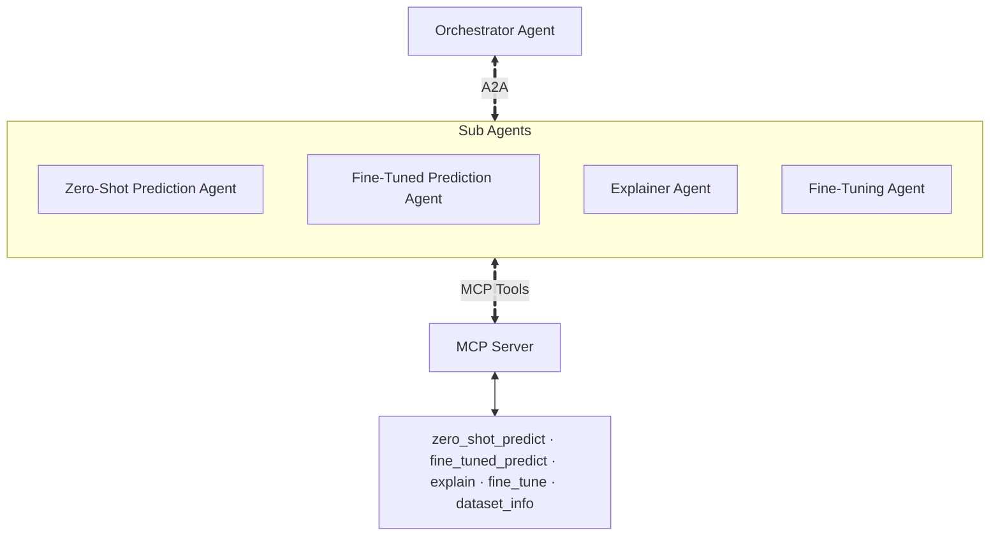

# A2A Network Test Repository - Claude-Mem Evaluation

> **Note:** This is a sanitized test repository used to evaluate [claude-mem](https://github.com/thedotmack/claude-mem), a persistent memory tool for agentic IDEs. See the accompanying article for full test results and analysis.

## Overview

This repository contains an A2A (Agent-to-Agent) network implementation for statement truthfulness classification. The project demonstrates multi-agent orchestration patterns and serves as a realistic test bed for evaluating session memory and context management in agentic coding tools.

### Core Components

The system implements binary classifier agents for statement truthfulness:
- **Zero-shot LLM predictor** - Direct inference without fine-tuning
- **Fine-tuned LLM predictor** - Custom-trained model for improved accuracy
- **Explainer** - Provides reasoning behind truthfulness classifications
- **Fine-tuning agent** - Manages model training workflows

## Architecture

The system uses an orchestrator-based A2A pattern with MCP (Model Context Protocol) for tool access:



### A2A Specifications
- **Capability Discovery**: Each sub-agent provides a `/.well-known/agent-card.json` for orchestrator discovery
- **Task Delegation**: The orchestrator routes requests to appropriate sub-agents based on user query
- **Tool Access**: Sub-agents communicate with the MCP server for specialized tools

### Project Tree
```text
a2a-network-test-repo/
├── mcp_package                       #MCP Server Folder
│   ├── __init__.py
│   ├── config.py                     #Configures env or arg variables
│   ├── local_server.py               #stdio mcp server for general testing
│   ├── schemas                       
│   │   ├── __init__.py
│   │   └── schemas.py                #pydantic models for agent inputs
│   ├── server.py                     #sse mcp server for deployment
│   └── tools                         #MCP Toolset
│       ├── __init__.py
│       ├── explainer_tools.py
│       ├── fine_tune_tools.py
│       ├── predictor_tools.py        #contains both zero-shot and fine-tuned prediction tools
│       └── shared_tools.py           #contains dataset_info_tool
├── pyproject.toml                    #install requirements
├── truth_agent
│   ├── __init__.py
│   ├── a2a_apps                      #wrap sub agents with A2A and ASGI, used to deploy with uvicorn
│   │   ├── __init__.py
│   │   ├── explain.py
│   │   ├── fine_tuned.py
│   │   ├── fine_tuning.py
│   │   └── zero_shot.py
│   ├── agent.py                      #for running with adk web, just routes orchestrator to expected 'root'
│   ├── auth.py                       #request authentication                       
│   ├── orchestrator.py               #define Orchestrator and RemoteA2A sub agents
│   ├── sub_agents                    #define sub agents, instructions, assign tools
│   │   ├── __init__.py
│   │   ├── explainer_agent.py
│   │   ├── fine_tuned_prediction_agent.py
│   │   ├── fine_tuning_agent.py
│   │   └── zero_shot_prediction_agent.py
│   ├── telemetry.py                  #otel setup 
│   └── web.py                        #deployed version of orchestrator as app
│
└── truth_predictor                   #base python package, used as building blocks for agents
    ├── __init__.py
    ├── config.py                     #configure env or arg variables
    ├── explainer.py                  
    ├── fine_tuned_predictor.py
    ├── truth_predictor.py
    ├── utils.py                      #file manip, I/O, model schema, tuning job launch functions
    └── zero_shot_predictor.py
```

## Reproducing the Claude-Mem Test

This repository was used to test claude-mem's effectiveness across multiple dimensions: session continuity, pattern reuse, and decision recall. In this session, we describe the steps we followed and led to the results described in the blogpost.
### Installation and setup

To properly incorporate `claude-mem` with your IDE, refer to the instructions at https://github.com/thedotmack/claude-mem.

In our case, we used Claude Code as the provider.

### Test Setup

The test compares two configurations:
- **Config A**: Claude Code without claude-mem (baseline)
- **Config B**: Claude Code with claude-mem enabled

To set up both configurations:

```bash
# Create two separate directory clones
mkdir -p ~/claude-mem-test/config-a
mkdir -p ~/claude-mem-test/config-b

# Clone the repo into each
cd ~/claude-mem-test/config-a
git clone https://github.com/george-konstantoulas/a2a-network-test-repo.git a2a-network-test-repo

cd ~/claude-mem-test/config-b
git clone https://github.com/george-konstantoulas/a2a-network-test-repo.git a2a-network-test-repo
```

### Toggling Claude-Mem

We found it's easiest to change your settings before starting each session and not tinker with the running service of claude-mem. For example, Claude Code has a `~/.claude/settings.json` where you can toggle if claude-mem is enabled or not. Adjust this following part for you IDE of choice.

**To disable claude-mem** (Config A):
```bash
jq '.enabledPlugins["claude-mem@thedotmack"] = false' .claude/settings.json > tmp.json && mv tmp.json .claude/settings.json
```

**To enable claude-mem** (Config B):
```bash
jq '.enabledPlugins["claude-mem@thedotmack"] = true' .claude/settings.json > tmp.json && mv tmp.json .claude/settings.json
```

After you've set the appropriate value, navigate to the corresponding directory, and run `claude`.

> **Note** This needs checking before starting sessions. Sessions starting inside `config-a` need claude-mem disabled and sessions in `config-b` need claude-mem enabled. Otherwise the cross-project leakage bug we describe in the article will occur.

### Test Execution

Run the following prompts in order for each configuration (A and B). Complete Session 1, close Claude Code, then start a fresh session for Session 2.

#### Session 1: Establishing Baseline Work

Start Claude Code in the project directory:
```bash
# For Config A (no memory)
cd ~/claude-mem-test/config-a/a2a-network-test-repo
claude

# For Config B (with memory)
cd ~/claude-mem-test/config-b/a2a-network-test-repo
claude
```

**Prompt 1 - Add Retry/Backoff Policy:**
```
Add a retry decorator with exponential backoff to handle transient failures when monitoring the fine-tuning job in utils.py. Use the pattern:
- Decorator named @retry_with_backoff
- Max 5 retries
- Exponential backoff: 2^retry_count seconds
- Catch temporary API errors
- Log each retry attempt with the error

Apply it to the train() function where it monitors sft_job.refresh().
```

**Prompt 2 - Add Status-Check Tool:**
```
I need you to add a new MCP tool called `batch_status_tool` to the mcp_package/tools/ directory.

This tool should track the status of ongoing prediction batches - it takes a batch_id as input and returns status info like: number of statements processed, number remaining, current model being used, and estimated completion time.

Add it to the shared_tools.py file since all agents might need to check batch status. Make sure to register it in the MCP server's tool list.
```

**Prompt 3 - Remove Status-Check Tool:**
```
We need to drop the batch status tool. The system processes batches
synchronously - upload CSV, wait for predictions (5-8 minutes for ~150
statements), download results.
```

Close Claude Code after these prompts complete.

#### Session 2: Testing Memory & Recall

Start a fresh Claude Code session (new terminal, new `claude` invocation) in the same directory.

**Test 1 - Basic Session Continuity:**
```
What did we work on yesterday?
```

Expected outcome:
- **Without claude-mem**: Guesses from git changes
- **With claude-mem**: Recalls actual session summary

**Test 2 - Temporal Awareness:**
```
What did we do last week?
```

Expected outcome:
- **Without claude-mem**: Checks commits, concludes nothing happened
- **With claude-mem**: Queries memory database, confirms no observations from that period

**Test 3 - Hallucination Check:**
```
How did we implement API call rate limiting?
```

Expected outcome:
- **Without claude-mem**: may hallucinate (e.g., confuse retry logic with rate limiting)
- **With claude-mem**: Searches memory, confirms no rate limiting was implemented

**Test 4 - Pattern Reuse:**
```
The zero shot predictor makes API calls that could fail transiently.
Add retry logic to handle temporary failures when calling the model.
```

Expected outcome:
- Both configurations should find the existing retry pattern by reading code
- Using `/mem-search` may increase token usage without adding value for code-based patterns

**Test 5 - Decision Recall:**
```
I want to add better visibility into prediction batches.
Should I implement a batch_status_tool to track in-progress predictions?
```

Expected outcome:
- **Without claude-mem**: Guesses from codebase
- **With claude-mem**: Uses `/mem-search` to recall why the tool was removed